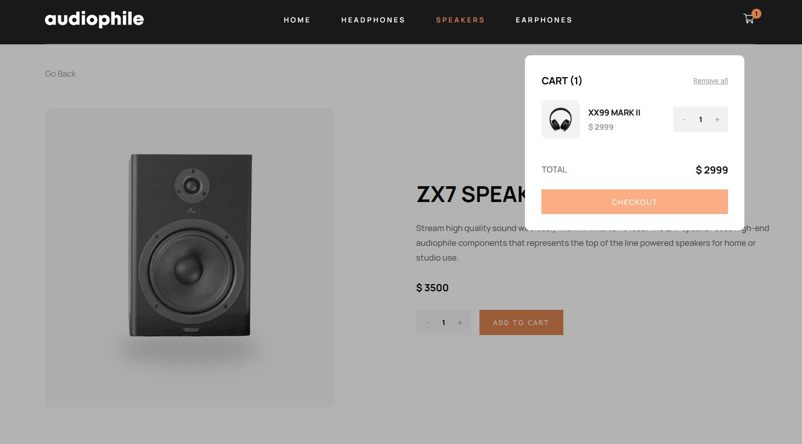

# Audiophile

Audiophile is an e-commerce website offering headphones, earhpones, speakers, and audio accessories. Built from scratch with Next.js, it is my first major project where I had to manage a complicated architecture. This is a solution to the [Audiophile e-commerce website challenge on Frontend Mentor](https://www.frontendmentor.io/challenges/audiophile-ecommerce-website-C8cuSd_wx).

**Link to project:** https://audiophile-kvz4pg5jc-pskrzypek97.vercel.app/



## How To Run It Locally

1. Clone the repo

```sh
   git clone https://github.com/pskrzypek97/Audiophile.git
```

2. Install NPM packages

```sh
npm install
```

3. Run the development server:

```sh
npm run dev

```

4. Open [http://localhost:3000](http://localhost:3000) with your browser to see the result.

## Tech used

- TS
- Sass
- [Next.js](https://nextjs.org/) - React Framework
- [Framer Motion](https://www.framer.com/motion/) - JS Library
- [react-hook-form](https://react-hook-form.com/) - JS Library

## How It's Made

To create such a complex project, I started by creating a plan. The first step was to write the HTML for each page, which I used to create the structure of the whole project. I split the project into 5 pages: Home, Category, Product, Checkout and 404. Next, I began writing styles. I split them into 4 folders: base, components, layout and utils, following the [7 to 1 Architecture](https://www.learnhowtoprogram.com/user-interfaces/building-layouts-preprocessors/7-1-sass-architecture), although for this specific case 7 folders were a bit too many. I used [BEM methodology](https://getbem.com/) to name my classes because it allows me to easily follow all my styles. While writing media queries, I created 5 breakpoints: large (1250px), big (1000px), medium (850px), small (600px) and tiny (550px). To manage the responsivity of my pages and components, I used Flexbox and Grid.

After writing all styles and checking how they behave on different screen sizes, I planned on paper each React component, deleted the HTML files and created Next.js app with [`create-next-app`](https://github.com/vercel/next.js/tree/canary/packages/create-next-app). I put all provided assets into the public folder and the provided data into the data folder. Following documentation of Next.js, I put all files managing pages into a pages folder. There, each file has its own route, starting with index.tsx which is a Home page. Next, there is a [category] folder whose index file corresponds to Category page. Each category page is statically generated using data from shopData.js and there are 3 categories: Headphones, Speakers and Earphones. This folder also contains [slug].tsx file which controls the Product page and each slug is a product name from shopData.js. Both [category]/index.tsx and [category]/[slug].tsx get their data by calling getStaticProps on build time. Another folder is the checkout one, which contains [id].tsx file. The slug of this page comes from cart id which is generated each time new cart gets created. The last files of the pages folder are 404.tsx, which appears when a user accesses a wrong route, \_app.tsx, which is a root file of the whole project, and \_document.tsx, which I used to provide 'lang' attribute for accessibility reasons. All components are kept in components folder where each component has its own subfolder.

Context API and Redux are both used to manage state in the app. There are 3 modals: HamburgerMenu, SuccessModal and Cart, which are managed inside ModalProvider.tsx. I use Redux (cart.ts) to control the cart state. Each time a user adds, removes or changes the amount of product/s, 3 values change in the CartSlice: cart which is an array of all products, total which is a sum of all products and id which is an unique string generated when first product is added to the cart.

I put a form validation inside Checkout folder. I decided to use the [react-hook-form](https://react-hook-form.com/) library because it handles complex forms well and requires minimal amount of code to run forms. To make the form work, I simply wrap the whole form inside FormProvider (Checkout.tsx). Because of that, each of the child components of Checkout: Billing, EMoney, Payment and Shipping have access to useFormContext hook which has a register method. This method allows me to register inputs and apply validation rules to them. I moved all the rules into inputData.js to follow the DRY principle and shorten each of these components. useFormContext contains also the formState object which has an error object I use to show an error message when a particular input is wrong.

The hooks folder contains 4 hooks: **useImage**, **useLayout**, **useProduct** and **useSuccessModal**. **useImage** hook returns an image based on the width of user's screen after providing an object containing 3 fields: desktop, tablet and mobile. Each field is a string which is a path to an image. I wanted to use Next.js' Image component, but it does not work with the HTML source tag, so instead I created useImage to provide the right image on each breakpoint. Unfortunately, the Image component requires width and height when src prop is a path string and it was breaking my styles. Therefore, I stayed with the source and img tags and used the useImage only in the Story component. **useLayout**, **useProduct** and **useSuccessModal** I created to refactor and shorten components using them (Layout, Product and SuccessModal).

[Framer Motion](https://www.framer.com/motion/) library is used to manage animations around the page. Smaller animations, like buttons or inputs, I wrote in the styles folder. Bigger animations, like the appearence of sections while scrolling or the fading of modals, I manage with the library. I created a variants folder to reuse animation variants among many components.

The last folder is models, which contains TS interfaces shared around the whole app.

## Lessons Learned

Audiophile has been my first multi-page project. It was also my first time using Next.js and Typescript. I definitely enjoyed using Next.js, as it is basically framework built on top of React, which I have used before. I had to learn how routing and static side rendering works, but other than that I knew how to work with React. On the other hand, Typescript brought me quite a headache. The code in JS would not give me any error, but here it was giving me plenty. Fortunately, I was able to fix them all and now I know how to work with TS, although I still have plenty of things to learn.

## Future Improvements

1. Refactor Checkout and its children components.
2. Write styles following mobile-first approach.
